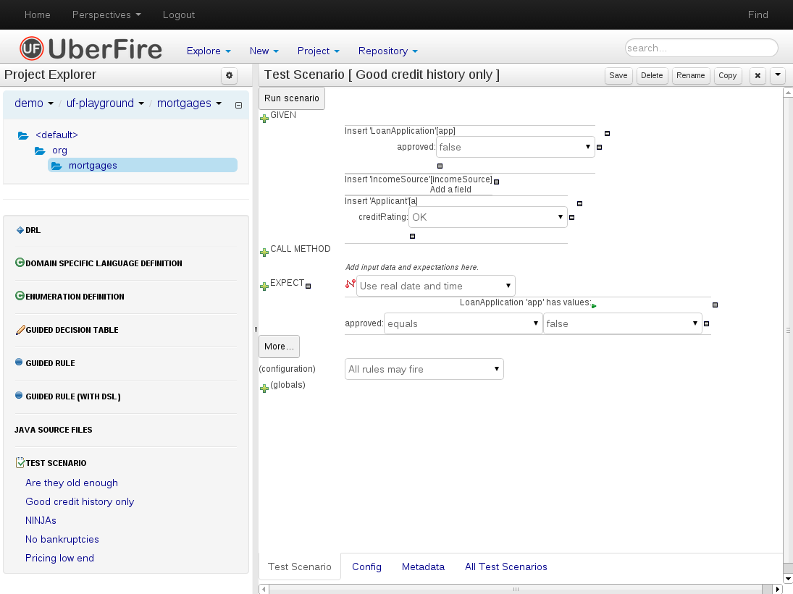

# Editor
An Editor is a WorkbenchPart that perform some editor function to a specific file-type. The content is associated with a VFS path and usually represents some sort of document that can be edited and saved.

